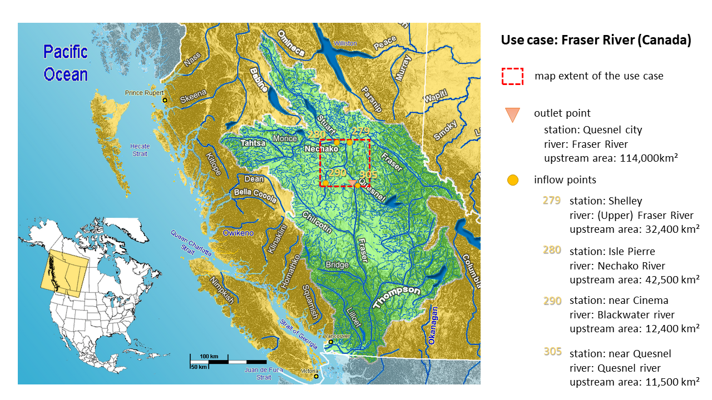
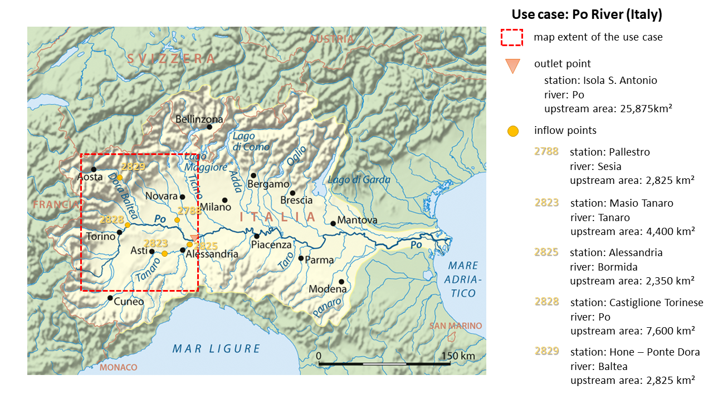

# Lisflood use cases

This repository hosts usecases for LISFLOOD model.
Go to [Lisflood OS page](https://ec-jrc.github.io/lisflood/) for more information.

**Other useful resources**

| **Project**         | **Documentation**                                         | **Source code**                                               |
| ------------------- | --------------------------------------------------------- | ------------------------------------------------------------- |
| Lisflood            | [Model docs](https://ec-jrc.github.io/lisflood-model/)    | https://github.com/ec-jrc/lisflood-code                       |
|                     | [User guide](https://ec-jrc.github.io/lisflood-code/)     |                                                               |
| Lisvap              | [Docs](https://ec-jrc.github.io/lisflood-lisvap/)         | https://github.com/ec-jrc/lisflood-lisvap                     |
| Calibration tool    | [Docs](https://ec-jrc.github.io/lisflood-calibration/)    | https://github.com/ec-jrc/lisflood-calibration                |
| Lisflood Utilities  |                                                           | https://github.com/ec-jrc/lisflood-utilities                  |
| Lisflood Usecases   |                                                           | https://github.com/ec-jrc/lisflood-usecases (this repository) |

## Use case 1: Fraser River, British Columbia, Canada  

### Short description 
The first use case is located in West Canada, in a basin called Fraser. The Fraser River rises at Fraser Pass near Blackrock Mountain in the Rocky Mountains and discharges into the Pacific Ocean at the city of Vancouver. With its 1,375 km length, it is the longest river within British Columbia and the 11th longest river in Canada. The basin size is about 220,000 km2, while the annual discharge at its mouth is 3,550 m3.

For testing the LISFLOOD code we prepared all the required input (maps) for a subsection of the Fraser basin (see red dashed box in Figure above). The maps cover the river section from the Nechako tributary in the North till the Quesnel tributary in the South. The outlet point of our test case is located on the main Fraser river at the hight of the Quesnel city and has an upstream area of 114,00 km2. As our subsection covers only a relatively small portion of the outlet's upstream catchment, four inlet points have been implemented (called Shelley, Isle Pierre, near Cinema and near Quesnel) accounting for the discharge (of the Upper Fraser, Nechako, Blackwater and Quesnel river respectively) prior to "inflowing" into our map area.   

As this is a use case form our global setup, all input maps are in the geographical system WGS84, with latitude and longitude. The map extend is 52.6o to 54o North and -121.4o to -124.5o West, with a horizontal resolution of 0.1 degree. The standard map format is netCDF.

There are several important components of this use case that you can find in the parent folder:
- [pre edited LISFLOOD settings files](https://github.com/ec-jrc/lisflood-usecases/tree/master/LF_lat_lon_UseCase): two files: *settings_LF_CUT-PreRun000758494230.xml* for the warm up and *settings_LF_CUT-Run000758494230.xml* for the actual running
- [static maps of the Fraser river subsection](https://github.com/ec-jrc/lisflood-usecases/tree/master/LF_lat_lon_UseCase/maps), with everything included e.g. soil-, landuse-, topography-, etc. related information
- meteorological input data from 02.01.1986 till 01.01.2018
- [reference output](https://github.com/ec-jrc/lisflood-usecases/blob/master/LF_lat_lon_UseCase/streamflow_simulated_best.csv), to check that everything went correctly

### How to get it running

xxx

## Use case 2: Po River, Italy 

### Short description 
The second use case is located in North Italy, in the Po River Basin. Its spring is at Monte Viso in Piemonte (Italy) at about 3,700 m; from there it flows 652 km eastwards till it flows into the Adriatic Sea close to Venice. The whole basin covers about 74,000 km², of which 70,000 km² are on Italian territory, and the remaining are shared between France and Switzerland. The average annual discharge at the river mouth is about 1,540 m³/s, whereas the maximum is about double of that.

Description of use case 2.

### How to get it running

